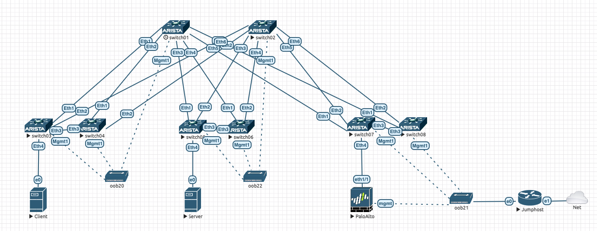
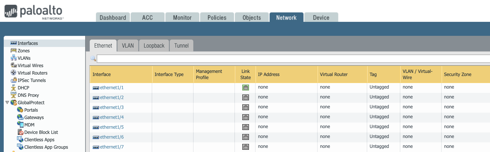
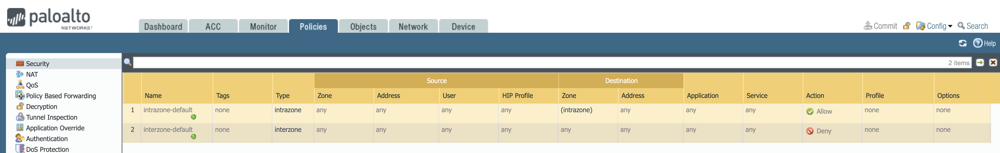
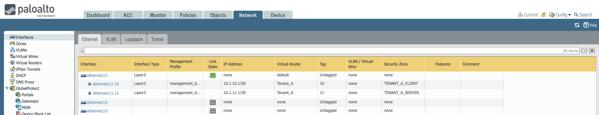
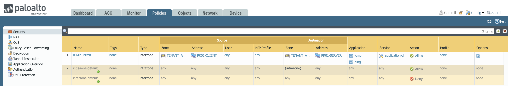
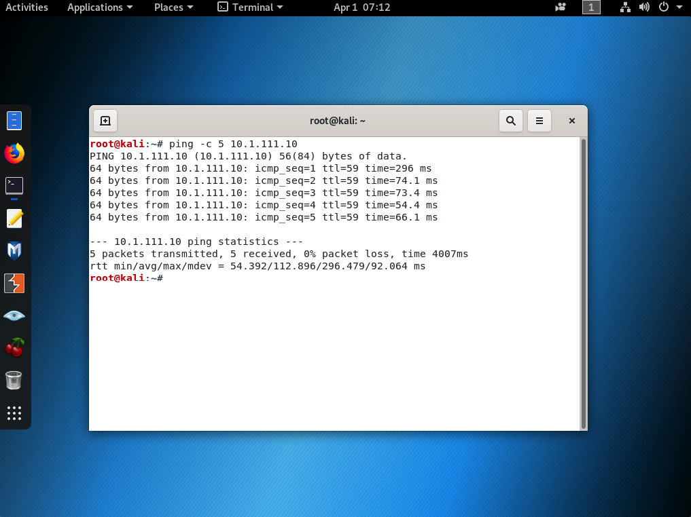

# Demo script

## Topology

Repository is going to build the following topology with an IP Fabric running EVPN whith 1 tenant, 2 VRFs to connect 1 server, 1 client and 1 firewall each on a POD.

> Note: this design does not implement redundancy.



Client:
- VRF: `TENANT_A_CLIENT`
- Network:
  - Client: 10.1.110.0/24
  - Firewall interconnection: 10.1.10.0/30
- Client VM: `10.1.110.10/24`

Server:
- VRF: `TENANT_A_SERVER`
- Network:
  - Server: 10.1.111.0/24
  - Firewall interconnection: 10.1.11.0/30
- Server VM: `10.1.111.10/24`

> Client and server VMs must be provisioned manually

Firewall connect both VRFs with following settings:

- VRF: `Tenant_A` (configured as `virtual_router`)
- Client security zone: `TENANT_A_CLIENT`
- Server security zone: `TENANT_A_SERVER`
## Check initial state

### On Arista EOS devices

Check that interfaces are UP and configured for the underlay aspect

```
switch03#show interfaces status
Port       Name                           Status       Vlan     Duplex Speed  Type            Flags Encapsulation
Et1        P2P_LINK_TO_SWITCH01_ethernet1 connected    routed   full   10G    EbraTestPhyPort
Et2        P2P_LINK_TO_SWITCH02_ethernet1 connected    routed   full   10G    EbraTestPhyPort
Et3        MLAG_PEER_switch04_Ethernet3   connected    in Po3   full   10G    EbraTestPhyPort
Et4        SWITCH013_ethernet1            connected    in Po4   full   10G    EbraTestPhyPort
Et5                                       connected    1        full   10G    EbraTestPhyPort
Et6                                       connected    1        full   10G    EbraTestPhyPort
Et7                                       connected    1        full   10G    EbraTestPhyPort
Et8                                       connected    1        full   10G    EbraTestPhyPort
Ma1        oob_management                 connected    routed   a-full a-1G   10/100/1000
Po3        MLAG_PEER_switch04_Po3         connected    trunk    full   10G    N/A
Po4        SWITCH013_Po1                  notconnect   trunk    full   unconf N/A
```

Also check BGP sessions are established

```
switch03#show ip bgp summary
BGP summary information for VRF default
Router identifier 192.168.1.5, local AS number 65101
Neighbor Status Codes: m - Under maintenance
  Description              Neighbor      V AS           MsgRcvd   MsgSent  InQ OutQ  Up/Down State   PfxRcd PfxAcc
  switch04                 172.31.253.7  4 65101             12        11    0    0 00:02:17 Estab   10     10
  switch01_ethernet1       172.31.255.8  4 65001             14        13    0    0 00:02:14 Estab   7      7
  switch02_ethernet1       172.31.255.10 4 65001             12        16    0    0 00:02:14 Estab   7      7
```

And then, check there is no service configured on devices:

```
switch03#show vlan
VLAN  Name                             Status    Ports
----- -------------------------------- --------- -------------------------------
1     default                          active    Et5, Et6, Et7, Et8, PEt5, PEt6
                                                 PEt7, PEt8
4093  LEAF_PEER_L3                     active    Cpu, Po3
4094  MLAG_PEER                        active    Cpu, Po3

switch03#show bgp evpn summary
BGP summary information for VRF default
Router identifier 192.168.1.5, local AS number 65101
Neighbor Status Codes: m - Under maintenance
  Description              Neighbor    V AS           MsgRcvd   MsgSent  InQ OutQ  Up/Down State   PfxRcd PfxAcc
  switch01                 192.168.1.1 4 65001              6         7    0    0 00:02:17 Estab   0      0
  switch02                 192.168.1.2 4 65001              7         8    0    0 00:02:18 Estab   0      0

```

### Palo Alto

Check there is no configuration on device:



Also check firewall policies




## Validate lab connectivity

Run playbook `check-device-connectivity.yml` against your lab

```
$ ansible-playbook-vault playbooks/check-device-connectivity.yml

PLAY [Check connectivity to EOS devices] ********************************

TASK [Get facts from EOS devices] ********************************
...
```

## Build Configurations

### Network side configuration

- Execute playbook `avd-build-and-deploy.yml` with `build` tag

```shell
ansible-playbook playbooks/avd-build-and-deploy.yml --tags build --ask-vault-pass
```

- Revew configuration under [`dc1-inventory/intended/configs`](dc1-inventory/intended/configs)

### Security block configuration

In this case, only structured configurations will be available.

- Execute playbook `panos-config-deploy.yml` with `build` tag

```shell
ansible-playbook-vault playbooks/panos-config-deploy.yml --tags build --ask-vault-pass
```

- Review structured configuration with the file [`dc1-inventory/intended/structured_configs/firewall-pod03.yml`](dc1-inventory/intended/structured_configs/firewall-pod03.yml)

## Deploy configurations

### Network side

- Execute playbook `avd-build-and-deploy.yml` with `deploy` tag

```shell
ansible-playbook playbooks/avd-build-and-deploy.yml --tags deploy --ask-vault-pass
```

- Check services and ports are configured with following commands:
  - `show vlan` (on L3leaf and L2leaf)
  - `show bgp evpn summary` (on L3leaf)

### Security block

In this case, only structured configurations will be available.

- Execute playbook `panos-config-deploy.yml` with `deploy` tag

```shell
ansible-playbook-vault playbooks/panos-config-deploy.yml --tags deploy --ask-vault-pass
```

- Review configuration on device (interfaces and security objects)



- Try to run pings from Client VM to Server VM:

```bash
# from Client VM to Server VM
$ ping 10.1.111.10
```

> Your traffic should not work as security policy has not been deployed. But try to ping firewall interface. This test should work:

```bash
# from Client VM to Firewall interface
$ ping 10.1.10.2
```

- Execute playbook `panos-config-deploy.yml` with `policy` tag

```shell
ansible-playbook-vault playbooks/panos-config-deploy.yml --tags policy --ask-vault-pass
```



- Try again to run pings from Client VM to Server VM:

```bash
# from Client VM to Server VM
$ ping 10.1.111.10
```



Now you can experiment by adding new services and firewall configuration
