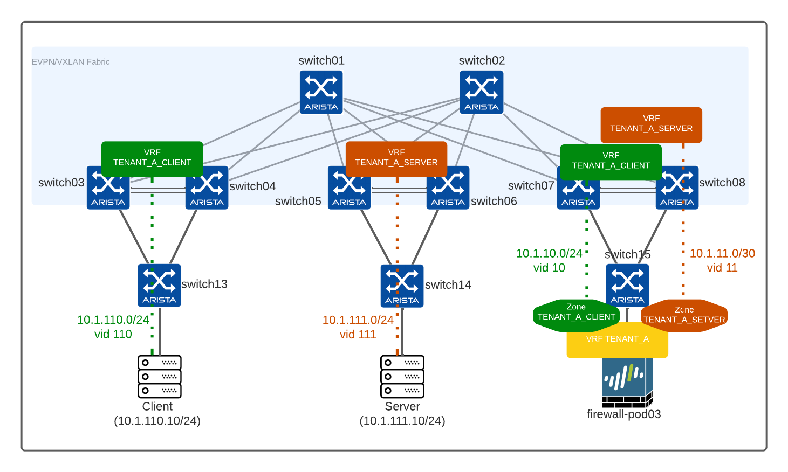

# Datacenter Automation demo

This repository is a demo for building a Datacenter (network & Firewalls) with ansible. All this automation content is based on [Arista AVD data model](https://www.avd.sh) with some deviations to add support for Firewall configuration.

## Topology

Repository is going to build the following topology with an IP Fabric running EVPN whith 1 tenant, 2 VRFs to connect 1 server, 1 client and 1 firewall each on a POD.

> Note: this design does not implement redundancy.



Client:
- VRF: `TENANT_A_CLIENT`
- Network:
  - Client: 10.1.110.0/24
  - Firewall interconnection: 10.1.10.0/30
- Client VM: `10.1.110.10/24`

Server:
- VRF: `TENANT_A_SERVER`
- Network:
  - Server: 10.1.111.0/24
  - Firewall interconnection: 10.1.11.0/30
- Server VM: `10.1.111.10/24`

> Client and server VMs must be provisioned manually

Firewall connect both VRFs with following settings:

- VRF: `Tenant_A` (configured as `virtual_router`)
- Client security zone: `TENANT_A_CLIENT`
- Server security zone: `TENANT_A_SERVER`

## Initial state

All devices are configured with a management IP address only and the following credentials: `ansible`/`ansible` and connected to an Out Of band management.

| Hostname | Managment IP  |
| -------- | ------------  |
| switch01 | 10.73.254.1/24|
| switch02 | 10.73.254.2/24|
| switch03 | 10.73.254.3/24|
| switch04 | 10.73.254.4/24|
| switch05 | 10.73.254.5/24|
| switch06 | 10.73.254.6/24|
| switch07 | 10.73.254.7/24|
| switch08 | 10.73.254.8/24|

## Build Initial network configuration

```bash
# Build configuration offline
ansible-playbook playbooks/avd-build-and-deploy.yml --tags build --ask-vault-pass
```

Once configurations are generated, you can review them and validate it is generated accordingly

```bash
# Deploy configuration
ansible-playbook playbooks/avd-build-and-deploy.yml --tags deploy --ask-vault-pass
```

As the goal of this repository is to detail how to extend data model, we won't go through AVD data model in detaul and it would be better to read [this repo example](https://github.com/titom73/ansible-avd-cloudvision-demo) or [AVD website](https://www.avd.sh)

## Build Security part

In our example, we will build data to provision Palo Alto firewall from data coming from AVD data model. Of course, since this data model is not built for security devices, we will extend some sections.

### Extend port definition:

Nothing special to do here as we won't configure an aggrgated interface. We just have to use Firewall hostname in firewalls keys.

```yaml
firewalls:
  FIREWALL-POD03:
    rack: POD03
    adapters:
      - type: nic
        server_ports: [ ethernet1/1 ]
        switch_ports: [ Ethernet4 ]
        switches: [ switch07 ]
        profile: A-PR01-FIREWALL
```

So our role is going to generate something like:

```yaml
interfaces:
  - if_name: "ethernet1/1"
    mode: "layer3"
```

### Generate sub interface

To generate sub-interfaces, we need to configure a bunch of things:

- Virtual Router (yes we want to isolate traffic) == Tenants in AVD
- Security Zones == VRFs in AVD
- Sub-interface information such as vlan tag and IP

To do that, we need to configure a firewalls knob under VRF/SVI

```yaml
tenants:
  # Tenant A Specific Information - VRFs / VLANs
  Tenant_A:
    mac_vrf_vni_base: 10000
    enable_mlag_ibgp_peering_vrfs: true
    vrfs:
      TENANT_A_CLIENT:
        vrf_vni: 10
        svis:
          110:
            name: 'PR01-CLIENT'
            tags: ['pod01']
            enabled: true
            ip_address_virtual: 10.1.110.254/24
          10:
            name: 'PR01-FW-INTERCO-CLIENT'
            tags: ['pod03']
            enabled: true
            ip_address_virtual: 10.1.10.2/30
            firewalls:
              - name: firewall-pod03
                is_aggregate_interface: true
                firewall_interface: ethernet1/1
                firewall_ip: 10.1.10.1/30
```

So after building template, you can get data ready to configure your Palo Alto:

```yaml
virtual_routers:
  - Tenant_A

security_zones:
  - TENANT_A_CLIENT
  - TENANT_A_SERVER

l3_subinterfaces:
  - name: "ethernet1/1.10"
    tag: 10
    enable_dhcp: false
    ip: ["10.1.10.1/30"]
    zone_name: "TENANT_A_CLIENT"
    management_profile: "standard-interface-management"
    virtual_router: "Tenant_A"
  - name: "ethernet1/1.11"
    tag: 11
    enable_dhcp: false
    ip: ["10.1.11.1/30"]
    zone_name: "TENANT_A_SERVER"
    management_profile: "standard-interface-management"
    virtual_router: "Tenant_A"
```

Also same process is used to generate a list of security objects based on SVIs address and being able to use them in the policy manager

### Create security policies

Here we just use model provided by [`paloaltonetworks.panos.panos_security_rule` module](https://ansible-pan.readthedocs.io/en/latest/modules/panos_security_rule_module.html).

```yaml
security_policies:
  - rule_name: 'ICMP Permit'
    rule_type: 'interzone'
    description: 'Allow ICMP checks'
    source_zone: ['TENANT_A_CLIENT']
    source_ip: ['PR01-CLIENT']
    destination_zone: ['TENANT_A_SERVER']
    destination_ip: ['PR01-SERVER']
    application: ['icmp', 'ping']
    action: 'allow'
```

## Misc
### Congigure runner

```bash
$ sudo route -n add -net 10.73.254.0/24 10.73.1.240
```