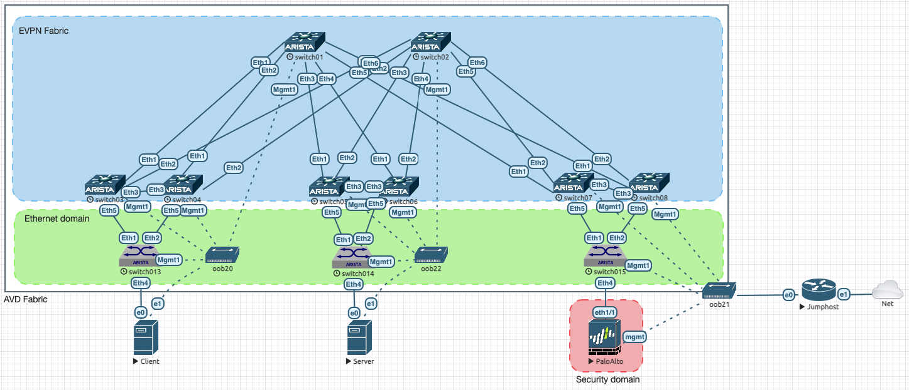

# Deploy EVE-NG LAb

Lab is based on EVE-NG with following images:

- Arista vEOS Lab 4.27.3F
- Palo Alto VM running Panos 8.0.0
- Debian 10 for Client/Server and Jumphost

Because Arista devices are preprovisioned with their management IP and basic IP connectivity, it is important to install image with ZTP process disable. If not, EOS will not be able to load configuration from the lab.

To install EOS image on eve-ng, the easiest way is [eos-downloader](https://github.com/titom73/eos-downloader) and your Arista API key:

```bash
# Connect to EVE-NG
ssh root@eve-ng-server

# Install EOS downloader
$ pip3 install eos-downloader

# Install image
eos-download --image vEOS-lab --version 4.27.3F --eve --noztp --token xxxxxx
```

Then, in EVE-NG, install lab from the github


At the result, you should have the following lab available:



Jumphost is configured to link your network environment with lab OOB and you may have to update its network settings:

- Username: user
- Password: Test123
- Configured IP for ens4: `10.73.1.240/24` <-- To be changed with your own settings
- Script to activate routing: [`expose-port.sh`](../expose-port.sh)
